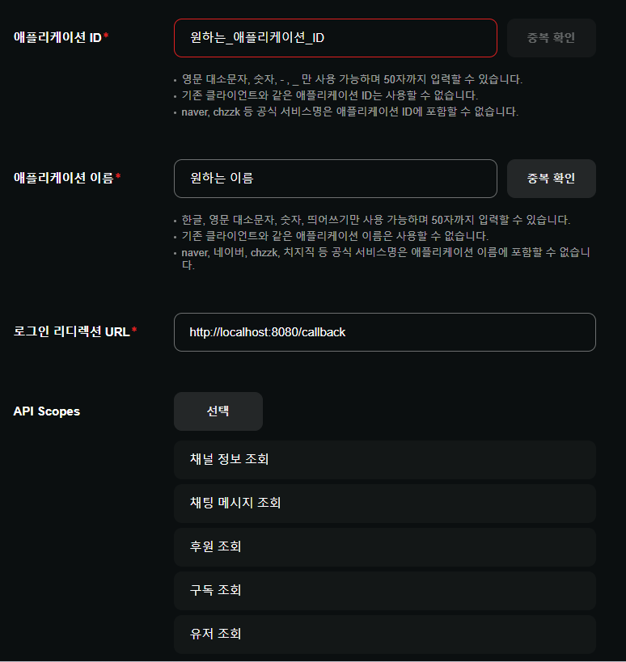

# Cheese-Bridge

## 명령어
```
/후원연동 | 치지직 로그인 창이 뜨며 약관 동의 시 연결이 됩니다. (방송 화면에 주소 노출 금지)
/연동해제 | 연결된 연결을 해제합니다. /후원연동 입력시 재연결됩니다.

- 관리자 전용 -
/후원 <player> <amount>
```

## kubejs 사용 방법
```javascript
const CheeseBridgeAPI = Java.loadClass("kr.pyke.integration.ChzzkBridge");
const PykeLib = Java.loadClass("kr.pyke.PykeLib");
const COLOR = Java.loadClass("kr.pyke.util.constants.COLOR");

CheeseBridgeAPI.DONATION_HANDLER = (player, event) => {
    let server = player.server;

    server.executeIfPossible(() => {
        const name = player.name.string;         // 받는 사람 (플레이어)
        const sender = event.donor();            // 보낸 사람 (후원자 닉네임)
        const amount = event.getAmount();        // 받은 후원 금액 (int)
        const message = event.donationMessage(); // 후원 메시지 (String)

        // [메시지 설정]
        // COLOR 상수는 RED, GOLD, YELLOW, LIME, AQUA, BLUE, PURPLE 등을 사용할 수 있습니다.
        // COLOR.LIME.getColor() 대신 0xFFFFFF 같은 Hex 코드를 직접 넣어도 됩니다.
        
        // PykeLib.sendSystemMessage(...); // 일반 채팅 메시지
        PykeLib.sendBroadcastMessage(      // 위아래 공백이 포함된 강조형 전체 메시지
            server.players, 
            COLOR.LIME.getColor(), 
            `§7${name}§f님이 §e${amount.toLocaleString()}치즈§f를 후원 받으셨습니다.`
        ); 

        // [조건부 보상 예시 1] 500,000원 후원 시
        if (amount === 500000) {
            let cmd = `tell ${name} 50만원 후원 받음 lol`;
            player.server.runCommand(cmd);
        }

        // [조건부 보상 예시 2] 1,000원 후원 시 다이아몬드 지급
        if (amount === 1000) {
            player.give('minecraft:diamond');
            player.tell(`1천원 받아서 다이아몬드 받음`);
        }
    });
};
```

## Config
```cheese_bridge.json
{
  "clientID": "YOUR_CLIENT_ID",
  "clientSecret": "YOUR_CLIENT_SECRET"
}
```

## 치지직 API 애플리케이션 등록 방법
https://developers.chzzk.naver.com/


